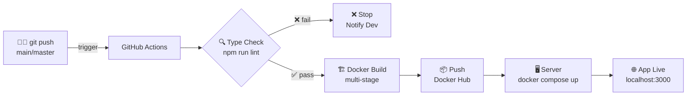

# 🚀 Hướng Dẫn Setup CI/CD — CFT Synapse IoT

## Tổng Quan Luồng



## Các File Đã Tạo

| File | Mục đích |
|---|---|
| `Dockerfile` | Multi-stage build: Node → Nginx Alpine |
| `nginx.conf` | SPA fallback + gzip + cache headers |
| `.github/workflows/docker-publish.yml` | GitHub Actions CI/CD pipeline |
| `docker-compose.yml` | Chạy app từ Docker Hub image |
| `.dockerignore` | Loại bỏ file không cần thiết khỏi build |

---

## Bước 1 — Tạo Docker Hub Access Token

1. Đăng nhập [hub.docker.com](https://hub.docker.com)
2. **Account Settings** → **Personal access tokens** → **Generate new token**
3. Đặt tên: `github-actions-cft-synapse`
4. Permission: **Read, Write, Delete**
5. **Copy token** (chỉ hiện 1 lần!)

---

## Bước 2 — Thêm Secrets vào GitHub Repository

Vào repo GitHub → **Settings** → **Secrets and variables** → **Actions** → **New repository secret**

Thêm lần lượt các secrets sau:

| Secret Name | Giá trị |
|---|---|
| `DOCKERHUB_USERNAME` | Docker Hub username của bạn |
| `DOCKERHUB_TOKEN` | Token vừa tạo ở Bước 1 |
| `VITE_SUPABASE_URL` | `https://xxx.supabase.co` |
| `VITE_SUPABASE_ANON_KEY` | Anon key từ Supabase dashboard |
| `VITE_API_GATEWAY_URL` | AWS API Gateway URL |
| `GEMINI_API_KEY` | Gemini API key |
| `APP_URL` | URL deploy của app |

> [!IMPORTANT]
> Các biến `VITE_*` sẽ được **embed thẳng vào bundle** lúc build (Vite behavior). Người dùng cuối không cần truyền env khi chạy container.

---

## Bước 3 — Cập Nhật docker-compose.yml

Mở `docker-compose.yml`, thay `YOUR_DOCKERHUB_USERNAME`:

```yaml
image: YOUR_DOCKERHUB_USERNAME/cft-synapse-iot:latest
#      ↑ ví dụ: nguyenvana/cft-synapse-iot:latest
```

---

## Bước 4 — Push Code Để Kích Hoạt Pipeline

```bash
git add .
git commit -m "feat: add CI/CD pipeline"
git push origin main
```

Theo dõi tiến trình tại: `GitHub repo → Actions tab`

---

## Bước 5 — Chạy App Trên Server / Máy Khác

Người dùng chỉ cần:

```bash
# 1. Tải docker-compose.yml về
curl -O https://raw.githubusercontent.com/YOUR_USER/YOUR_REPO/main/docker-compose.yml

# 2. Tạo file .env (chỉ cần nếu app có runtime server)
cp .env.example .env

# 3. Pull image mới nhất và chạy
docker compose pull
docker compose up -d

# 4. Xem logs
docker compose logs -f
```

App chạy tại: **http://localhost:3000**

---

## Tagging & Versioning

| Hành động | Tag Docker được tạo |
|---|---|
| Push vào `main` | `latest`, `sha-abc1234` |
| Push vào `feature/xyz` | `feature-xyz`, `sha-abc1234` |
| `git tag v1.2.0` + push | `v1.2.0`, `1.2`, `latest`, `sha-abc1234` |

### Tạo release version:
```bash
git tag v1.0.0
git push origin v1.0.0
```

---

## Các Lệnh Docker Hữu Ích

```bash
# Chạy thẳng không cần compose (đơn giản nhất)
docker run -d -p 3000:80 --name cft-app YOUR_DOCKERHUB_USERNAME/cft-synapse-iot:latest

# Xem container đang chạy
docker ps

# Xem logs
docker logs cft-app -f

# Dừng và xoá container
docker compose down

# Cập nhật lên phiên bản mới nhất
docker compose pull && docker compose up -d

# Kiểm tra image size
docker images YOUR_DOCKERHUB_USERNAME/cft-synapse-iot
```

---

## Troubleshooting

### ❌ Build fail do TypeScript error
```
Run: npm run lint
# Fix các lỗi type trước khi push
```

### ❌ Secrets not found
- Kiểm tra tên secret đúng chính xác (phân biệt hoa thường)
- Secrets chỉ available ở repo gốc, không phải fork

### ❌ App load nhưng route bị 404
- Đảm bảo `nginx.conf` đã được copy đúng vào image
- Kiểm tra `try_files $uri $uri/ /index.html;` trong nginx.conf

### ❌ Env vars không hoạt động trong app
> **Quan trọng:** `VITE_*` variables phải có **lúc build**, không phải lúc run container.
> Nếu cần thay đổi URL sau khi build → phải trigger CI/CD build lại.

---

## Cấu Trúc File Đã Tạo

```
CFT-synapse-iot/
├── .github/
│   └── workflows/
│       └── docker-publish.yml   ← GitHub Actions pipeline
├── Dockerfile                   ← Multi-stage build
├── nginx.conf                   ← SPA + gzip config
├── docker-compose.yml           ← Chạy từ Docker Hub
└── .dockerignore                ← Tối ưu build context
```
