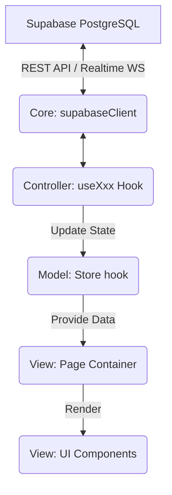

# Tài liệu Kiến trúc Hệ thống: IoT-SOC Frontend

Tài liệu này ghi lại toàn bộ cấu trúc dự án `synapse-iot` sau quá trình refactor sang mô hình **MVC (Model - View - Controller)** kết hợp với **Supabase Backend-as-a-Service**. Bạn có thể dùng tài liệu này làm kim chỉ nam để tiếp tục phát triển các tính năng UI và logic sau này.

---

## 1. Tổng quan Kiến trúc (High-Level Architecture)

Dự án áp dụng mô hình **Modular MVC**, chia tay giao diện (React Components) hoàn toàn khỏi logic nghiệp vụ (Hooks/Supabase) và định nghĩa dữ liệu (Types/Adapters).

### Sơ đồ luồng dữ liệu (Data Flow)


### Triết lý thiết kế (Design Principles)
- **Single Source of Truth**: Backend Supabase là nguồn sống duy nhất. `.env` chứa URL và Key. Tất cả bảng Database được map chính xác thành Typescript type trong `core/lib/database.types.ts`.
- **Phân tách trách nhiệm (Separation of Concerns)**: Components UI **không bao giờ** được gọi fetch() hay trực tiếp móc tới Supabase. Mọi truy vấn phải thông qua Controller.
- **Data Transformation**: Dữ liệu từ DB (Row) thường thô (timestamp ISO, snake_case). `adapter.ts` xử lý việc chuyển đổi thành `UIModel` (chữ cái đầu viết hoa, format ngày giờ đẹp) trước khi đưa lên UI.

---

## 2. Bản đồ Thư mục (Directory Structure)

```text
src/
├── core/                           # 1. TẦNG LÕI (Dùng chung cho cả app)
│   ├── lib/
│   │   ├── supabaseClient.ts       # Singleton instance của Supabase
│   │   └── database.types.ts       # Type gen từ schema DB thật (11 tables)
│   ├── models/
│   │   ├── auth.types.ts           # Types liên quan tới user, app state
│   │   └── api.types.ts            # (Cũ) Xử lý error/response
│   ├── views/
│   │   ├── BaseLayout.tsx          # Wrapper bọc Sidebar & Topbar
│   │   └── LoadingSpinner.tsx      # Atom spinner
│   ├── controllers/
│   │   ├── useApiClient.ts         # Hook alias: export { useSupabase }
│   │   └── useWebSocket.ts         # (Cũ) Có thể bỏ vì đã xài Supabase Realtime
│   └── index.ts                    # Core Barrel (xuất file cho app dùng dễ)
│
├── modules/                        # 2. TẦNG NGHIỆP VỤ (8 Module độc lập)
│   ├── dashboard/                  # Tổng quan hệ thống
│   ├── live-monitor/               # Log cảnh báo Realtime (FR 1.1)
│   ├── threat-analytics/           # Phân tích log & gán nhãn (FR 2.x)
│   ├── mlops/                      # Huấn luyện AI OTA (FR 3.x, 4.x)
│   ├── fleet-mgmt/                 # Quản lý thiết bị Node
│   ├── model-insights/             # So sánh model AI
│   ├── reports/                    # Báo cáo & Audit Logs
│   └── settings/                   # Cấu hình ngưỡng cảnh báo
│
├── utils/                          # 3. TIỆN ÍCH DÙNG CHUNG
│   ├── constants.ts                # LOG_BUFFER_LIMIT, RETRAIN_POLL_INTERVAL...
│   └── helpers.ts                  # formatDate, formatPct...
│
└── App.tsx                         # 4. ENTRY POINT
                                    # Router (Switch-Case), kết hợp tất cả các modules lại.
```

---

## 3. Cấu trúc chuẩn của MỘT Module (Standard Module Pattern)

Mỗi module trong số 8 modules trên (ví dụ: `dashboard`, `live-monitor`) ĐỀU tuân thủ định dạng 3 thư mục nội bộ sau:

### Lớp Model (`src/modules/[tên-module]/model/`)
- **`types.ts`**: Chứa toàn bộ Typescript interface. Gồm 2 loại: Type nguyên bản từ DB (ví dụ: `AlertRow`) và Type dùng cho hiện thị UI (ví dụ: `AlertUIModel`).
- **`adapter.ts`**: (Tùy chọn) Chứa các hàm `adaptXxx()`. Có nhiệm vụ nhận DB Row đầu vào, format lại dữ liệu (VD: đổi timestamp thành "14:30 12/05") và trả ra UI Model.
- **`store.ts`**: Chứa React State (hiện tại dùng `useState`, có thể nâng cấp lên Zustand nếu phức tạp). Quản lý cờ `isLoading`, cờ `error`, và dữ liệu chính của trang.

### Lớp Controller (`src/modules/[tên-module]/controller/`)
- **`useXxx.ts`**: Trái tim của module.
  - Gọi database thông qua `supabase.from('table_abc')`.
  - Nhận dữ liệu thô, đẩy qua `adapter.ts` format.
  - Cầm state lấy từ `store.ts` để gán dữ liệu vào.
  - Expose ra ngoài các hàm actions (`refresh()`, `submit()`, `delete()`).
- **`index.ts`**: Barrel xuất Hook ra.

### Lớp View (`src/modules/[tên-module]/view/`)
- **`pages/XxxPage.tsx`**: (Container Component)
  - Là component cao nhất của module. Định nghĩa Layout.
  - Có nhiệm vụ: Khởi tạo controller `const { logs, isLoading, refresh } = useXxx();`
  - Truyền dữ liệu xuống các components con qua props.
- **`components/`**: (Presentational Component)
  - Code HTML/CSS/Tailwind thuần.
  - "Ngu ngốc" (Dumb component) - chỉ biết nhận `props` và render giao diện. KHÔNG bao giờ chứa logic gọi API.
- **`index.ts`**: Barrel xuất Page ra cho `App.tsx` dùng.

---

## 4. Bảng Tra cứu CSDL Supabase (Database Mapping)

Mã nguồn hiện tại đã được đấu nối (wired) trực tiếp vào schema DB Supabase của bạn thông qua Typescript. Nếu bạn làm tiếp UI, hãy dựa vào bảng map này để biết mình đang ở đâu:

| Module Frontend | React Hook | Tương tác với Bảng Supabase | Tính năng chính |
|---|---|---|---|
| **Dashboard** | `useDashboard()` | `alerts_all`<br>`edge_nodes` | Đếm số node online, gom lỗi 24h, danh sách lỗi mới nhất. |
| **Live Monitor** | `useLiveMonitor()` | `alerts_all` | Sử dụng **Supabase Realtime** để "hứng" (subscribe) sự kiện INSERT. Hiệu ứng log nhảy liên tục. Giới hạn buffer là 1000 dòng. |
| **Threat Analytics**| `useThreatAnalytics()` | `network_flows_feedback_all` | Lọc dữ liệu log. Cho phép Upsert feedback (Relabel) vào trường `feedback_true_label`. |
| **Fleet Mgmt** | `useFleet()` | `edge_nodes`<br>`node_telemetry` | Lấy danh sách Node. Có **Realtime UPDATE** để biết node nào sập, node nào CPU cao ngay lập tức. |
| **MLOps Hub** | `useMlops()` | `model_versions`<br>`retrain_jobs_all`<br>`deployments_all` | Lấy chỉ số model mới nhất. Kick-off lệnh Retrain. Polling (3s) để xem tiến trình (% Retrain). Lưu lệnh OTA Deploy. |
| **Model Insights** | `useModelInsights()` | `flow_inference`<br>`model_versions` | So sánh chi tiết kết quả dự đoán của từng loại mô hình (Edge vs Cloud). |
| **Reports** | `useReports()` | `alerts_all` | Lấy các cột Audit (`audit_action`, `audit_target`, `audit_created_at`) để dựng khung Audit Logs. |
| **Settings** | `useSettings()` | `homes`<br>`users_roles_settings` | Update ngưỡng cảnh báo (cloud threshold, drift level) trực tiếp vào bảng `homes`. |

---

## 5. Hướng dẫn làm tiếp (Next Steps cho Lập trình viên)

Dự án hiện đã hoàn thiện nền móng ngầm (Under-the-hood). Việc làm tiếp theo của bạn 100% xoay quanh việc **vẽ UI (giao diện)**.

### Cách vẽ giao diện mới cho một chức năng:
1. Mở file `src/modules/[module-name]/view/pages/[Name]Page.tsx`.
2. Hook `use[Name]()` đã có sẵn dữ liệu từ DB.
   ```tsx
   // Ví dụ trong FleetPage.tsx
   const { nodes, isLoading, error } = useFleet();
   ```
3. Chỉnh sửa file HTML JSX tại đó hoặc tạo component con ở thư mục `components/` kế bên, ném array `nodes` vào `props` để map ra các hàng bảng (Table Row) hoặc Biểu đồ (Charts).

### Các lệnh Terminal quan trọng:
- Chạy App: `npm run dev`
- Kiểm tra lỗi Typescript (Rất quan trọng khi sửa DB): `npx tsc --noEmit`
- Cài Tailwind/UI Library (Tuỳ chọn thêm): `npm install tailwindcss`

*Chúc bạn hoàn thiện nốt phần giao diện dễ dàng! Architecture đã sẵn sàng tải trọng mọi nghiệp vụ.*
