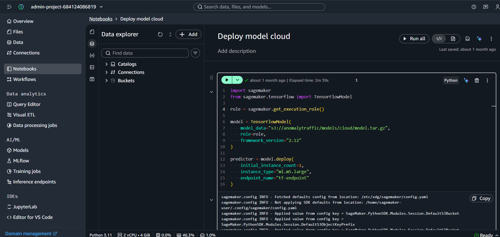
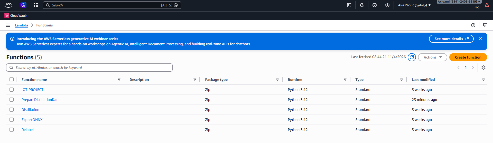
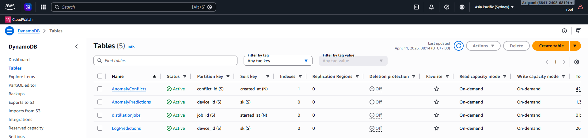

# Pipeline Chưng Cất Mô Hình IoT — AWS Architecture

> **Tổng quan:** Hệ thống tự động phát hiện bất thường mạng IoT, thu thập mâu thuẫn dự đoán, tự gán nhãn lại và chưng cất mô hình nhỏ hơn (LightGBM) từ mô hình thầy (Teacher — SageMaker) để cuối cùng xuất ra file ONNX nhẹ, sẵn sàng triển khai trên thiết bị biên.

---

## Tài nguyên AWS sử dụng

| Tài nguyên | Tên / ID | Vai trò |
|---|---|---|
| **S3 Bucket** | `anomalytraffic` | Lưu trữ trung tâm cho data thô, dự đoán, models |
| **DynamoDB** | `AnomalyPredictions` | Kết quả dự đoán của mô hình cloud từ luồng anomaly |
| **DynamoDB** | `LogPredictions` | Kết quả dự đoán của mô hình cloud từ luồng log thông thường |
| **DynamoDB** | `AnomalyConflicts` | Các bản ghi mâu thuẫn cần xử lý |
| **DynamoDB** | `distillationjobs` | Trạng thái các job chưng cất |
| **SageMaker Endpoint** | `tf-endpoint` | Mô hình Teacher chạy inference |
| **Script** | `DeployCloudmodel.py` | Tạo & deploy SageMaker Endpoint từ model đã train |
| **Lambda** | `IOT-PROJECT` | Inference của mô hình cloud + phát hiện conflict |
| **Lambda** | `Distillation` | Scheduler kiểm tra ngưỡng kích hoạt Relabel |
| **Lambda** | `Relabel` | Tự động gán nhãn lại conflict |
| **Lambda** | `PrepareDistillationData` | Xuất CSV data training và gọi hàm Fine-Tune |
| **Lambda** | `Triggerfinetuning` | Khởi chạy SageMaker Training Job: Fine-Tune Teacher |
| **Lambda** | `TriggerDistillation` | Khởi chạy SageMaker Training Job: Distillation Student |
| **Lambda (Docker)** | `ExportONNX` | Convert LightGBM → ONNX |
| **EventBridge** | CloudWatch Events | Trigger `Distillation.py` định kỳ (Hourly) |

---

## Cấu trúc S3 Bucket `anomalytraffic`

```
anomalytraffic/
├── data/
│   ├── anomalies/anomaly/      ← Input: file JSON luồng bất thường (từ thiết bị)
│   ├── raw/log/                ← Input: file JSON luồng log thông thường (từ thiết bị)
│   │   └── scaler_stats.json   ← Thống kê scaler (mean, scale, feature_names)
│   └── distillation/
│       └── train/              ← Output CSV dùng để train Student model
├── predictions/
│   ├── anomalyprediction/      ← Kết quả dự đoán của mô hình cloud từ luồng anomaly
│   └── logprediction/          ← Kết quả dự đoán của mô hình cloud từ luồng log
├── models/
│   ├── cloud/                  ← Teacher model artifact (model.tar.gz — TF SavedModel)
│   └── edge/                   ← Student model sau khi train (ONNX / LightGBM)
└── scripts/                    ← Lambda deployment packages
```

---

## Luồng Hoạt Động Toàn Hệ Thống

```
┌─────────────┐       S3 Event       ┌──────────────────┐
│  IoT Device │ ──── upload JSON ───► │  Lambda          │
│  / Sensor   │                       │  IOT-PROJECT.py  │
└─────────────┘                       └────────┬─────────┘
                                               │
                              ┌────────────────┼─────────────────┐
                              │                │                 │
                              ▼                ▼                 ▼
                      SageMaker          DynamoDB            S3 (predictions/)
                      Endpoint           AnomalyPredictions  _pred.json
                      (inference)        LogPredictions
                              │
                        Conflict?
                              │ YES
                              ▼
                       DynamoDB
                       AnomalyConflicts
                       (status: pending)

                              │
                    ┌─────────┴──────────┐
                    │  EventBridge       │ (Scheduled Cronjob)
                    │  → Lambda          │
                    │  Distillation.py   │
                    └─────────┬──────────┘
                              │ count >= THRESHOLD?
                              │ YES (async invoke)
                              ▼
                       Lambda: Relabel.py
                              │ (async invoke khi hoàn tất)
                              ▼
                  Lambda: PrepareDistillationData.py
                  Query AnomalyConflicts WHERE status='relabeled' AND relabel_confidence='high'
                              │
                              ▼
                   Xuất CSV → S3: data/distillation/train/
                              │ (async invoke)
                              ▼
                   Lambda: Triggerfinetuning.py
                              │ (Tạo Training Job)
                              ▼
                 [SageMaker Fine-Tune Teacher CNN]
                 (Nếu model improve -> Cập nhật Endpoint)
                              │ (async invoke từ chính Code SageMaker)
                              ▼
                  Lambda: TriggerDistillation.py
                              │ (Tạo Training Job)
                              ▼
                  [SageMaker Distillation LightGBM]
                  (Dùng soft-labels học từ Teacher)
                              │
                              ▼
                   Model .txt → S3: models/edge/lightgbm/
                              │ (async invoke từ chính Code SageMaker)
                              ▼
                  Lambda (Docker Image): ExportONNX
                  Convert LightGBM → ONNX
                              │
                              ▼
                   ONNX Model → S3: models/onnx/
                   ✅ Sẵn sàng deploy lên Edge Device
```

---

## Chi Tiết Từng Bước

### Bước 0 — Deploy Cloud Model Real Time (`DeployCloudmodel.py`)

**Mục đích:** Khởi tạo SageMaker Endpoint `tf-endpoint` — đây là **điều kiện tiên quyết** để toàn bộ pipeline hoạt động. Script này cần chạy **một lần duy nhất** (hoặc mỗi khi cần redeploy model mới) trước khi các Lambda bắt đầu gọi inference.

**Chạy tại:** SageMaker Notebook Instance hoặc môi trường có `sagemaker` SDK và IAM Role hợp lệ.

**Code:**

```python
import sagemaker
from sagemaker.tensorflow import TensorFlowModel

role = sagemaker.get_execution_role()

model = TensorFlowModel(
    model_data="s3://anomalytraffic/models/cloud/model.tar.gz",
    role=role,
    framework_version="2.12"
)

predictor = model.deploy(
    initial_instance_count=1,
    instance_type="ml.m5.large",
    endpoint_name="tf-endpoint"
)
```

**Quy trình:**
1. Lấy IAM Execution Role từ SageMaker environment (`get_execution_role()`)
2. Khởi tạo `TensorFlowModel` trỏ đến file model đã đóng gói tại `s3://anomalytraffic/models/cloud/model.tar.gz`
3. Deploy model lên một instance `ml.m5.large` (1 instance) với tên endpoint `tf-endpoint`
4. Sau khi deploy xong, `tf-endpoint` sẵn sàng nhận request inference từ Lambda `IOT-PROJECT`

**Cấu hình quan trọng:**

| Tham số | Giá trị | Mô tả |
|---|---|---|
| `model_data` | `s3://anomalytraffic/models/cloud/model.tar.gz` | S3 URI của model artifact (TF SavedModel nén) |
| `framework_version` | `2.12` | Phiên bản TensorFlow của serving container |
| `instance_type` | `ml.m5.large` | Loại instance cho inference |
| `initial_instance_count` | `1` | Số instance khởi đầu |
| `endpoint_name` | `tf-endpoint` | Tên endpoint — **phải khớp** với biến `SAGEMAKER_ENDPOINT` trong Lambda |

> **Lưu ý quan trọng:**
> - Model artifact phải được đóng gói đúng định dạng TensorFlow SavedModel: `model.tar.gz` chứa thư mục `1/` (hoặc `00001/`) bên trong.
> - **CỰC KỲ QUAN TRỌNG ĐỂ CÓ THỂ FINE-TUNE:** Mô hình ban đầu phải được lưu bằng lệnh của Keras (`model.save("1")` hoặc `tf.keras.models.save_model(...)`) chứ **tuyệt đối không dùng** `tf.saved_model.save()`. Nếu thiếu hệ thống metadata gốc của Keras (file `keras_metadata.pb`), hệ thống chỉ có thể chạy Live Inference nhưng sẽ văng lỗi khi cố gắng Unfreeze để Fine-Tune (vì nó bị biến thành base `_UserObject`).
> - `framework_version="2.12"` phải tương thích với TensorFlow version dùng khi training.
> - Quá trình deploy thường mất **3–5 phút** — script sẽ block và chờ đến khi endpoint `InService`.
> - IAM Role cần có permission: `sagemaker:CreateModel`, `sagemaker:CreateEndpointConfig`, `sagemaker:CreateEndpoint`, và `s3:GetObject` trên bucket `anomalytraffic`.



---

### Bước 1 — Inference & Phát hiện Conflict (`IOT-PROJECT.py`)

**Trigger:** S3 Event khi có file JSON mới upload vào `data/`

**Logic routing theo đường dẫn S3:**

| S3 Prefix | Loại nguồn | Expected Label | DynamoDB Target |
|---|---|---|---|
| `data/anomalies/anomaly/` | Luồng bất thường (attack) | `attack` | `AnomalyPredictions` |
| `data/raw/log/` | Luồng log thường | `benign` | `LogPredictions` |

**Quy trình xử lý mỗi file:**
1. Đọc file JSON từ S3 (hỗ trợ multi-line NDJSON)
2. **Feature Engineering** cho mỗi flow:
   - Trích xuất 28 đặc trưng số từ thống kê gói tin
   - Tính toán các tỉ lệ dẫn xuất: `pkt_per_byte_ratio`, `flow_symmetry`, `byte_symmetry`, flag ratios (SYN, ACK, PSH,...), port bucket
   - Mã hóa `application_category_name` (28 categories → số nguyên)
3. **Chuẩn hóa** vector đặc trưng với `scaler_stats.json` (z-score: `(x - mean) / scale`)
4. **Gọi SageMaker Endpoint** → nhận xác suất 5 lớp: `Benign / Botnet / DDoS / DoS / PortScan`
5. **Phát hiện Conflict** theo quy tắc:

```
Nguồn anomaly  → Dự đoán Benign     CONFLICT (model bỏ sót tấn công)
Nguồn log      → Dự đoán Attack     CONFLICT (model báo nhầm lưu lượng bình thường)
```

6. Ghi **tất cả kết quả** vào DynamoDB (AnomalyPredictions / LogPredictions)
7. Ghi **conflict** riêng vào `AnomalyConflicts` với `status: "pending"`
8. Lưu file kết quả tổng hợp `*_pred.json` vào S3 `predictions/`



---

### Bước 2 — Scheduler Kiểm tra Ngưỡng (`Distillation.py`)

**Trigger:** EventBridge (CloudWatch Events) — chạy định kỳ (ví dụ: mỗi 6 giờ hoặc 1 ngày)

**Biến môi trường cần thiết:**

| Tên biến | Ví dụ | Mô tả |
|---|---|---|
| `CONFLICTS_TABLE` | `AnomalyConflicts` | Tên bảng DynamoDB |
| `THRESHOLD` | `100` | Số conflict tối thiểu để kích hoạt |
| `RELABEL_FUNCTION` | `Relabel` | Tên Lambda cần invoke |

**Quy trình:**
1. Query DynamoDB `AnomalyConflicts` qua GSI `status-index` với `status = "pending"`
2. Đếm tổng số conflict (có xử lý pagination)
3. Nếu `count >= THRESHOLD` → **async invoke** Lambda `Relabel`
4. Nếu chưa đủ → log và kết thúc

>  **Lý do dùng async invoke:** Relabel có thể xử lý hàng trăm records, tránh timeout Lambda 15 phút

---

### Bước 3 — Tự Động Gán Nhãn Lại (`Relabel.py`)

**Trigger:** Được invoke async từ `Distillation.py`

**Quy tắc gán nhãn theo Route:**

| Expected | Actual (Model dự đoán) | Kết quả | Confidence |
|---|---|---|---|
| `attack` | `Benign` | `attack_needs_review` | `low`  Cần review thủ công |
| `Benign` | Bất kỳ attack | `Benign` | `high`  Tự động sửa |
| Khác | Khác | Giữ expected | `low`  Fallback |

**Lý do thiết kế:**
- Khi model dự đoán Benign nhưng nguồn là attack → **không biết đây là loại tấn công nào** → phải để con người xem lại
- Khi model dự đoán attack nhưng nguồn là log thường → **tin tưởng nguồn dữ liệu gốc** → sửa thành Benign với confidence cao

**Output DynamoDB (update item):**
```json
{
  "status": "relabeled",
  "correct_label": "Benign",
  "relabel_confidence": "high",
  "relabel_reason": "Log source incorrectly predicted as DDoS - corrected to Benign",
  "needs_manual_review": false,
  "relabeled_at": "2026-04-11T08:00:00+00:00"
}
```

---

### Bước 4 — Tổng Hợp Data Training (`PrepareDistillationData.py`)

**Trigger:** Tự động bằng async `lambda_client.invoke` do `Relabel.py` bắn ra ngay khi nó hoàn thành.

**Biến môi trường cần thiết:**

| Tên biến | Ví dụ | Mô tả |
|---|---|---|
| `CONFLICTS_TABLE` | `AnomalyConflicts` | Tên bảng DynamoDB |
| `BUCKET` | `anomalytraffic` | S3 bucket đích |

**Quy trình:**
1. Query `AnomalyConflicts` với `status = "relabeled"` **VÀ** `relabel_confidence = "high"`
2. Kiểm tra: cần ít nhất **10 samples** để bắt đầu
3. Với mỗi conflict:
   - Parse `flow_data` (JSON stored as string)
   - Map label text → số: `Benign=0, Botnet=1, DDoS=2, DoS=3, PortScan=4`
   - Tạo row CSV: `{label: N, ...flow_features}`
4. Ghi CSV vào `/tmp/` rồi upload lên S3: `data/distillation/train/distillation_train_YYYYMMDD_HHMMSS.csv`
5. **Mark conflicts đã dùng**: cập nhật `status = "used"` để không train lại
6. **Trigger Pipeline tiếp theo**: Hàm Lambda tự động gọi `Triggerfinetuning.py` (async) để báo hiệu cho SageMaker chuẩn bị train.

> **Lưu ý quan trọng về data chưng cất:**
> - Chỉ lấy `relabel_confidence = "high"` → loại bỏ các case cần review thủ công
> - Data chưng cất **KHÔNG** phải mọi prediction, mà chỉ là các case **mà Teacher model bị nhầm** và đã được sửa lại
> - Mục đích: dạy Student model không lặp lại lỗi của Teacher

**Output:** `s3://anomalytraffic/data/distillation/train/distillation_train_20260411_080000.csv`

---

### Bước 5 — Chưng Cất Mô Hình (`Distillation.py` + SageMaker Training)

> **Lưu ý:** File `Distillation.py` hiện tại đóng vai trò **scheduler/orchestrator**, không phải phần training model thực sự. Phần training LightGBM Student model được chạy bởi một SageMaker Training Job riêng

**Flow hoàn chỉnh của Knowledge Distillation:**

```
Teacher Model (SageMaker tf-endpoint)
    │ Soft labels (probabilities) từ inference
    │
    ▼
AnomalyConflicts (DynamoDB)
    │ Cases model Teacher bị sai
    │
    ▼
Relabeled Data (high confidence only)
    │
    ▼
CSV Training Data (S3: data/distillation/train/)
    │
    ▼
LightGBM Student Model Training
(SageMaker Training Job / EC2)
    │
    ▼
model.txt (S3: models/lightgbm/)
```

---

### Bước 5.1 — Fine-tune Teacher Model (`finetune/FineTuneTeacher.py`)

**Mục đích:** Cập nhật mô hình Teacher (CNN) với dữ liệu mới từ conflict data đã được gán nhãn lại. Quy trình này giúp Teacher model học những case khó mà nó từng bị sai.

**Kích hoạt:**
- Tự động hoàn toàn (Automated): Được API của hàm Lambda `Triggerfinetuning.py` tạo ngay lập tức khi `PrepareDistillationData` ra được CSV mới.

**Cấu trúc folder `finetune/`:**
```
finetune/
├── FineTuneTeacher.py    ← Script chính
└── Dockerfile            ← Docker image (Python 3.10 + TensorFlow 2.13)
```

**Quy trình Fine-tune:**

1. **Load Training Data**
   - Lấy CSV từ input channel (thường từ S3 → SageMaker channel)
   - Trích xuất features (columns bắt đầu bằng `feature_`) và label
   - Làm đệm/cắt ngắn đến 75 features, reshape thành `(N, 75, 1)`

2. **Load Teacher Model**
   - Download `model.tar.gz` từ S3 (`s3://anomalytraffic/models/cloud/`)
   - Extract và load TensorFlow SavedModel thông qua Keras (`tf.keras.models.load_model`)
   - **Lưu ý:** Chỉ load thành công để train tiếp nếu mô hình trước đó có file `keras_metadata.pb` (được đóng gói từ mã nguồn gốc bằng lệnh `model.save()`).

3. **Baseline Evaluation**
   - Đánh giá accuracy của mô hình cũ trên validation set
   - In ra per-class accuracy cho từng lớp: Benign, Botnet, DDoS, DoS, PortScan

4. **Fine-tune**
   - Unfreeze toàn bộ layers
   - Compile với Adam optimizer (learning rate mặc định: `1e-4`)
   - Callbacks: EarlyStopping (patience=3), ReduceLROnPlateau (factor=0.5, patience=2)
   - Epochs mặc định: 10

5. **Compare Accuracy**
   - Tính improvement = `accuracy_after - accuracy_before`
   - Yêu cầu tối thiểu improvement: `--min-improvement` (mặc định: 0.001 = 0.1%)
   - **Nếu improvement >= threshold:**
     - ✅ Upload model.tar.gz mới lên S3
     - 💾 Backup model cũ vào `models/cloud/backups/`
     - 🔄 Update SageMaker Endpoint (blue-green deployment)
     - 🚀 Trigger Lambda `TriggerDistillation` để bắt đầu distillation pipeline
   - **Nếu improvement < threshold:**
     - ⚠️ Giữ model cũ, không upload model mới
     - Pipeline dừng

6. **Report**
   - Lưu JSON report chứa: accuracy_before, accuracy_after, improvement, accepted flag
   - Upload report lên S3: `models/cloud/reports/finetune_*.json`

**Biến Môi Trường:**

| Tên biến | Ví dụ | Mô tả |
|---|---|---|
| `BUCKET` | `anomalytraffic` | S3 bucket chứa model |
| `TEACHER_ENDPOINT` | `tf-endpoint` | Tên SageMaker endpoint (dùng để update) |
| `DISTILL_FUNCTION` | `TriggerDistillation` | Lambda function trigger distillation |
| `SM_CHANNEL_TRAINING` | `/opt/ml/processing/input` | Input directory (SageMaker channel) |
| `SM_MODEL_DIR` | `/opt/ml/model` | Output directory cho model |
| `SM_OUTPUT_DATA_DIR` | `/opt/ml/output/data` | Output directory cho data/report |
| `SAGEMAKER_ROLE` | `arn:aws:iam::...` | IAM role có permission SageMaker |

**Command Line Arguments:**

```bash
python FineTuneTeacher.py \
  --epochs 10 \
  --batch-size 32 \
  --learning-rate 1e-4 \
  --min-improvement 0.001
```

| Tham số | Mặc định | Mô tả |
|---|---|---|
| `--epochs` | `10` | Số epoch fine-tune |
| `--batch-size` | `32` | Batch size |
| `--learning-rate` | `1e-4` | Learning rate |
| `--min-improvement` | `0.001` | Yêu cầu improvement tối thiểu |

**Cách chạy trên SageMaker:**

```python
from sagemaker.estimator import Estimator

estimator = Estimator(
    image_uri="<ECR_ACCOUNT>.dkr.ecr.<REGION>.amazonaws.com/distillation-finetune:latest",
    role="arn:aws:iam::<ACCOUNT>:role/<ROLE>",
    instance_count=1,
    instance_type="ml.p3.2xlarge",  # Cần GPU
    output_path="s3://anomalytraffic/models/cloud/",
    environment={
        'BUCKET': 'anomalytraffic',
        'TEACHER_ENDPOINT': 'tf-endpoint',
        'DISTILL_FUNCTION': 'TriggerDistillation',
        'SAGEMAKER_ROLE': '<ROLE_ARN>'
    }
)

estimator.fit(
    inputs="s3://anomalytraffic/data/distillation/train/",
    job_name="finetune-teacher-20260411"
)
```

---

### Bước 5.2 — Knowledge Distillation: Train Student Model (`distill/IOT-PROJECT.py`)

**Mục đích:** Huấn luyện mô hình Student nhỏ gọn (LightGBM) với "soft labels" từ Teacher model. Mục đích là học những trường hợp khó mà Teacher bị sai, nhưng với chi phí inference thấp hơn trên edge device.

**Kích hoạt:**
- Tự động hoàn toàn (Automated): Do Hàm Lambda `TriggerDistillation.py` (được gọi từ Script `FineTuneTeacher.py` nếu đáp ứng ngưỡng improvement) kích hoạt.

**Cấu trúc folder `distill/`:**
```
distill/
├── IOT-PROJECT.py    ← Script chính (tên này theo naming convention)
└── Dockerfile        ← Docker image (Python 3.10 + LightGBM 4.0)
```

**Quy trình Distillation:**

1. **Load Training Data**
   - Lấy CSV từ input channel
   - Trích xuất features (columns `feature_*`)
   - Không cần label cứng (hard labels) — soft labels sẽ từ Teacher

2. **Get Soft Labels từ Teacher Endpoint**
   - Call SageMaker `tf-endpoint` với batches của 100 samples
   - Teacher output: xác suất 5 classes → `(N, 5)`
   - **Temperature Scaling** (T = 3.0 mặc định):
     - Softens probabilities: `logits = log(probs) / T`
     - Làm mô hình Student học được sự *không chắc chắn* của Teacher
   - Extract soft label cho class cần học (ví dụ: class 1 = Attack)

3. **Train/Val Split**
   - 80% training, 20% validation

4. **Train LightGBM**
   - Params:
     - `num_leaves`: 127 (mặc định)
     - `max_depth`: 6
     - `learning_rate`: 0.05
     - `n_estimators`: 400
   - Objective: binary classification (regression on soft labels)
   - Metrics: binary_logloss, AUC
   - Early stopping: patience=30

5. **Evaluate**
   - Tính ROC-AUC trên validation set
   - Tính accuracy (với threshold 0.5)

6. **Save & Upload**
   - **Local saves:**
     - `student_lgbm.txt` — LightGBM text format (nhỏ gọn, 1-2 MB)
     - `student_lgbm.pkl` — Pickle format (dùng để load ngay trong Python)
     - `metadata.json` — Metadata (feature names, accuracy, best_iteration, etc.)
   - **Upload to S3:** `s3://anomalytraffic/models/edge/lightgbm/`

7. **Trigger ExportONNX**
   - Async invoke Lambda `ExportONNX`
   - Convert `student_lgbm.txt` → ONNX format
   - ONNX model sẽ available at `s3://anomalytraffic/models/onnx/`

**Biến Môi Trường:**

| Tên biến | Ví dụ | Mô tả |
|---|---|---|
| `BUCKET` | `anomalytraffic` | S3 bucket |
| `TEACHER_ENDPOINT` | `tf-endpoint` | SageMaker endpoint của Teacher |
| `EXPORT_FUNCTION` | `ExportONNX` | Lambda function export ONNX |
| `SM_CHANNEL_TRAINING` | `/opt/ml/processing/input` | Input directory |
| `SM_MODEL_DIR` | `/opt/ml/model` | Model output directory |
| `SM_OUTPUT_DATA_DIR` | `/opt/ml/output/data` | Data output directory |

**Command Line Arguments:**

```bash
python IOT-PROJECT.py \
  --num-leaves 127 \
  --max-depth 6 \
  --learning-rate 0.05 \
  --n-estimators 400 \
  --temperature 3.0 \
  --task binary
```

| Tham số | Mặc định | Mô tả |
|---|---|---|
| `--num-leaves` | `127` | Số leaf nodes trong LightGBM |
| `--max-depth` | `6` | Độ sâu tối đa |
| `--learning-rate` | `0.05` | Learning rate |
| `--n-estimators` | `400` | Số boosting rounds |
| `--temperature` | `3.0` | Temperature scaling cho soft labels |
| `--use-soft-labels` | `true` | Dùng soft labels từ Teacher |
| `--task` | `binary` | `binary` hoặc `multiclass` |

**Cách chạy trên SageMaker:**

```python
from sagemaker.estimator import Estimator

estimator = Estimator(
    image_uri="<ECR_ACCOUNT>.dkr.ecr.<REGION>.amazonaws.com/distillation-student:latest",
    role="arn:aws:iam::<ACCOUNT>:role/<ROLE>",
    instance_count=1,
    instance_type="ml.m5.xlarge",  # Không cần GPU
    output_path="s3://anomalytraffic/models/edge/",
    environment={
        'BUCKET': 'anomalytraffic',
        'TEACHER_ENDPOINT': 'tf-endpoint',
        'EXPORT_FUNCTION': 'ExportONNX'
    }
)

estimator.fit(
    inputs="s3://anomalytraffic/data/distillation/train/",
    job_name="distillation-student-20260411"
)
```

**So sánh Teacher vs Student:**

| Đặc điểm | Teacher (CNN) | Student (LightGBM) |
|---|---|---|
| Framework | TensorFlow | LightGBM (tree-based) |
| Model size | ~50-100 MB | **1-2 MB** |
| Inference time | 50-100 ms | **1-5 ms** |
| Accuracy | ~95%+ | ~90-94% (accept trade-off) |
| Training cost | Cao (GPU) | Thấp (CPU) |
| Deployment | Cloud (SageMaker) | Edge device (ONNX) |
| Soft labels | ✅ Output dùng cho distillation | ❌ Input để học từ Teacher |

---

### Bước 7 — Xuất ONNX (`ExportONNX.py`)

**Trigger:** Tự động hoàn toàn: Function `ExportONNX` được gọi Async trực tiếp từ những giây cuối cùng của script huấn luyện chạy trong SageMaker Distillation (`distill/IOT-PROJECT.py`).

**Quy trình:**
1. Tìm model LightGBM mới nhất trong `s3://anomalytraffic/models/lightgbm/`
2. Download về `/tmp/model.txt`
3. Convert sang ONNX format (opset 12)
4. Upload lên `s3://anomalytraffic/models/onnx/model_{timestamp}.onnx`

> **Lưu ý triển khai ExportONNX:**
> - Các thư viện như `numpy`, `scikit-learn`, `lightgbm`, và `onnxmltools` có dung lượng rất lớn, vượt quá giới hạn 250MB của Lambda Layer.
> - **Bắt buộc:** Đóng gói hàm này thành Docker Container Image trước khi deploy lên AWS Lambda. (Xem chi tiết ở cấu hình cuối tài liệu).
> - `FloatTensorType([None, 15])` — con số **15 features** phải khớp với số feature thực tế trong model của bạn

---

## 🔧 Biến Môi Trường Lambda Cần Cấu Hình

### Script: `DeployCloudmodel.py` (tham số hardcode trong script)
| Tham số | Giá trị | Mô tả |
|---|---|---|
| `model_data` | `s3://anomalytraffic/models/cloud/model.tar.gz` | S3 path tới model artifact |
| `framework_version` | `2.12` | TensorFlow version |
| `instance_type` | `ml.m5.large` | Loại instance SageMaker |
| `endpoint_name` | `tf-endpoint` | Tên endpoint sau khi deploy |

### Lambda: `IOT-PROJECT`
| Biến | Giá trị ví dụ | Bắt buộc |
|---|---|---|
| `SAGEMAKER_ENDPOINT` | `tf-endpoint` | ✅ |
| `OUTPUT_BUCKET` | `anomalytraffic` | ✅ |
| `REGION` | `ap-southeast-2` | ✅ |
| `CONFLICTS_TABLE` | `AnomalyConflicts` | ✅ |

### Lambda: `Distillation`
| Biến | Giá trị ví dụ | Bắt buộc |
|---|---|---|
| `CONFLICTS_TABLE` | `AnomalyConflicts` | ✅ |
| `THRESHOLD` | `100` | ✅ |
| `RELABEL_FUNCTION` | `Relabel` | ✅ |

### Lambda: `Relabel` & `PrepareDistillationData`
| Biến | Giá trị ví dụ | Bắt buộc |
|---|---|---|
| `CONFLICTS_TABLE` | `AnomalyConflicts` | ✅ |
| `BUCKET` | `anomalytraffic` | ✅ |

---

## 📊 DynamoDB Schema Chi Tiết

### Bảng `AnomalyConflicts`

| Attribute | Type | Mô tả |
|---|---|---|
| `conflict_id` | String (PK) | UUID duy nhất |
| `created_at` | Number (SK) | Unix timestamp lúc tạo |
| `status` | String | `pending` → `relabeled` → `used` |
| `flow_data` | String | JSON serialized của toàn bộ flow features |
| `expected_label` | String | `attack` hoặc `Benign` |
| `actual_prediction` | String | JSON: `{label, confidence, probabilities}` |
| `conflict_reason` | String | Mô tả lý do conflict |
| `conflict_rule` | String | Rule name từ ROUTE_MAP |
| `source_key` | String | S3 key của file nguồn |
| `device_id` | String | ID thiết bị IoT |
| `correct_label` | String | Sau relabel: nhãn đúng |
| `relabel_confidence` | String | `high` hoặc `low` |
| `needs_manual_review` | Boolean | True nếu cần xem xét thủ công |

> **GSI cần tạo:** `status-index` với partition key là `status` — bắt buộc cho Relabel.py và Distillation.py



### Bảng `AnomalyPredictions` / `LogPredictions`

| Attribute | Type | Mô tả |
|---|---|---|
| `device_id` | String (PK) | ID thiết bị |
| `sk` | String (SK) | `{timestamp}#{flow_id}#{uuid8}` |
| `label` | String | Nhãn dự đoán |
| `confidence` | Decimal | Xác suất cao nhất |
| `probabilities` | Map | Xác suất từng lớp |

---

## Lưu Ý Quan Trọng Khi Vận Hành

1. **`DeployCloudmodel.py` phải chạy trước** khi bất kỳ Lambda nào gọi SageMaker — nếu endpoint `tf-endpoint` chưa tồn tại, Lambda `IOT-PROJECT` sẽ throw `EndpointNotFound` exception.

2. **GSI `status-index`** trên bảng `AnomalyConflicts` **PHẢI** được tạo để các query hoạt động — DynamoDB không tự tạo index.

3. **ExportONNX** bắt buộc dùng **Docker Container Image** do giới hạn dung lượng 250MB của một hàm AWS Lambda.

4. **Số feature trong ONNX** (`FloatTensorType([None, 15])`) phải khớp chính xác với số features thực tế trong Student model.

5. **PrepareDistillationData** chỉ query `relabel_confidence = 'high'` thông qua **FilterExpression**, không phải KeyCondition — DynamoDB sẽ scan toàn bộ `relabeled` items trước khi filter. Nếu dataset lớn, nên tạo thêm GSI compound: `(relabel_confidence, status)`.

6. **Hoạt động liên hoàn 100% không đứt đoạn**: Các bước từ Distillation đếm File 👉 Relabel 👉 Chuẩn bị CSV 👉 FineTune (SageMaker) 👉 Distillation (SageMaker) 👉 Export ONNX đều **chuyền tay nhau** một cách bất đồng bộ (`async API`). Sự kiện EventBridge phụ trợ theo dõi SageMaker Completion đã được loại bỏ để **tránh Double Execution (Luồng bị chạy 2 lần)**.

7. **Chi phí SageMaker Endpoint:** Instance `ml.m5.large` tính phí theo giờ ngay cả khi không có request — nên **delete endpoint** khi không cần dùng và redeploy bằng `DeployCloudmodel.py` khi cần.

---

## Vòng Đời Một Conflict Record

```
[S3 upload] → IOT-PROJECT dự đoán sai
                    │
                    ▼
          AnomalyConflicts
          status: "pending"
                    │
          (Distillation.py đủ threshold)
                    │
                    ▼
          Relabel.py xử lý
          status: "relabeled"
          relabel_confidence: "high" / "low"
                    │
          PrepareDistillationData lấy chỉ "high"
                    │
                    ▼
          status: "used"
          → Đã xuất vào CSV training
          → Triggerfinetuning đẩy vào SageMaker (Teacher)
          → TriggerDistillation đẩy vào SageMaker (Student)
          → ExportONNX xuất file cho Edge Device!
```

---

## Phụ lục: Hướng dẫn triển khai Lambda ExportONNX sử dụng Docker Container

Vì các thư viện như `numpy`, `scikit-learn`, `lightgbm`, và `onnxmltools` có dung lượng rất lớn, vượt quá giới hạn 250MB (unzipped size) của AWS Lambda (kể cả khi chia thành nhiều Layers hay upload qua S3), giải pháp tối ưu và "chuẩn chỉnh" nhất là **đóng gói tất cả vào một Docker Container Image**.

AWS Lambda hỗ trợ Container Image với giới hạn lên tới **10 GB**, dư sức để chạy các thư viện Machine Learning nặng.

### 📂 Cấu trúc thư mục (`ExportONNX_Docker/`)

- `Dockerfile`: File cấu hình để build Docker Image dựa trên base image Lambda Python 3.12 của AWS.
- `requirements.txt`: Danh sách các thư viện gộp (boto3, numpy, sklearn, onnx, lightgbm...).
- `ExportONNX.py`: Code lambda function.
- `build_and_push.ps1`: Script PowerShell tự động build và push Image lên Amazon ECR.

### 🚀 Hướng dẫn Deploy ExportONNX

#### Bước 1: Điều kiện tiên quyết
1. Máy tính đã cài đặt **Docker Desktop** và đang chạy.
2. Đã cài đặt **AWS CLI** và cấu hình tài khoản (có quyền ECR & Lambda).

#### Bước 2: Chạy script Build & Push
Mở **PowerShell**, di chuyển vào đúng thư mục `ExportONNX_Docker` và chạy lệnh sau:

```powershell
./build_and_push.ps1
```

Script này sẽ tự động:
1. Đăng nhập vào Amazon ECR (Elastic Container Registry).
2. Tạo ECR Repository có tên `export-onnx-lambda` (nếu chưa có).
3. Build Docker container chứa code và toàn bộ các thư viện nặng.
4. Push container lên AWS ECR.

#### Bước 3: Tạo/Cập nhật AWS Lambda Function lấy nguồn từ Container
1. Truy cập [AWS Lambda Console](https://console.aws.amazon.com/lambda/).
2. Chọn **Create function**.
3. Chọn tùy chọn **Container image** (thay vì "Author from scratch").
4. Đặt tên Hàm (ví dụ: `ExportONNXFunction`).
5. Ở mục **Container image URI**, nhấn **Browse images**, chọn repo `export-onnx-lambda` vừa push và chọn tag `latest`.
6. Nhấn **Create function**.

*Lưu ý: Nếu Lambda cần thêm quyền S3, hãy vào tab **Configuration** > **Permissions** để thêm IAM role cho nó. Cấp Memory cho function lớn một chút (ví dụ 1024MB - 2048MB) để quá trình convert model không bị lỗi Out of Memory.*

#### Bước 4 (Optional): Cập nhật function khi thay đổi code
Nếu bạn sửa code trong `ExportONNX.py`, bạn chỉ cần chạy lại `./build_and_push.ps1`. Sau đó vào AWS Lambda Console:
1. Vào function của bạn.
2. Tại tab **Image configuration**, nhấn **Deploy new image**.
3. Chọn lại image name: `export-onnx-lambda:latest` và nhấn **Save**.
